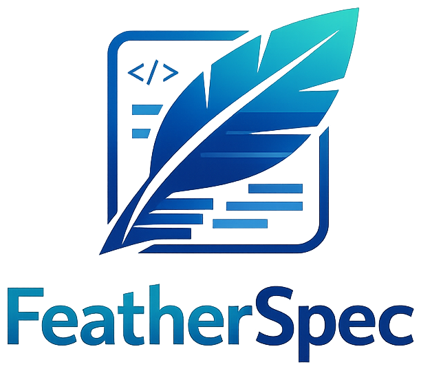
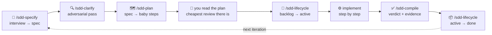

<div align="center">



**Spec-driven development that works in Claude Code _and_ GitHub Copilot — from the same files.**

No CLI. No install. No dependencies. Markdown and folders.

[](https://github.com/GregorBiswanger/featherspec/generate)
[](https://github.com/GregorBiswanger/featherspec/wiki)
[](LICENSE)

</div>

---

A chat forgets. FeatherSpec doesn't.

You describe **what** you want, your agent turns it into a **spec** with testable acceptance
criteria, then into a **plan** of baby steps — and only then writes code. Spec, plan, decisions
and progress all live on disk as Markdown in your repository, so the next session, the next
teammate, and the next tool pick up exactly where you left off.

Ten `/sdd-*` commands drive that loop, and they behave identically in Claude Code and in
GitHub Copilot, because both tools execute the **same files**.

---

## Start in two minutes

### 1 · Get the template

Click **[Use this template](https://github.com/GregorBiswanger/featherspec/generate)** on GitHub — or clone it:

```bash
git clone https://github.com/GregorBiswanger/featherspec.git my-project
```

The clone brings this repository's commit history along with a remote pointing back here. For
your own project you want neither: delete the `.git` folder (`rm -rf .git`, or
`Remove-Item -Recurse -Force .git` in PowerShell) and run `git init`.

**Have Node.js?** Then `degit` saves you that cleanup — it downloads only the current file
state, so there is no history and no `.git` folder to detach in the first place:

```bash
npx degit GregorBiswanger/featherspec my-project
```

### 2 · Open it in your assistant

**Claude Code**

```bash
cd my-project
claude
```

`CLAUDE.md` imports `AGENTS.md` at session start, so the rules are always loaded. Type `/` and
the `sdd-` commands are there.

**GitHub Copilot (VS Code)**

Open **the project folder itself** — not a parent folder, or the slash commands won't show up.
Open Copilot Chat (<kbd>Ctrl</kbd>/<kbd>Cmd</kbd> + <kbd>Alt</kbd> + <kbd>I</kbd>), switch to
**Agent** mode, and optionally pick the **SpecDrivenAgent** persona. Type `/` — same commands,
same behaviour.

### 3 · Run the wizard once

```text
/sdd-setup
```

It asks which language your documentation should be written in (answer `English`, `Deutsch`,
`Français`, … — everything the workflow writes from then on follows it), then a handful of
questions about the project. It seeds the Memory Bank and captures a first architecture
snapshot.

That is the entire installation. Nothing to build, nothing to run.

---

## Already have a codebase?

FeatherSpec is not greenfield-only. Run `/sdd-setup` and answer **existing software** — the
wizard offers a deep architecture scan that reads your code (recursively, with isolated scout
agents), lets you confirm the module boundaries it found, and distills a lean fingerprint into
the `architecture:` snapshot. It is resumable at any point, re-runnable whenever the snapshot
feels stale (`/sdd-architecture-scan`, optionally with a focus path), and it cleans up after
itself.

The payoff: agents jump straight to the right files instead of exploring — with verified
conventions and traps as grounds for better technical decisions — and the documentation can
never flood the context window: always loaded is only the sub-200-line constitution, while
per-module depth lives in ≤ 40-line maps that load only when their module is touched.
The full walkthrough lives in the wiki:
[Adopting an Existing Codebase](https://github.com/GregorBiswanger/featherspec/wiki/Adopting-an-Existing-Codebase).

---

## The loop



The spec says **what and why**. The plan says **how**, in steps small enough to verify one at a
time. Both are files, both are versioned, and a traceability table connects every acceptance
criterion to the steps, the code paths and the **test** that fulfil it.

Two of those boxes are not commands, and that is the point. `/sdd-clarify` reads your finished
spec as a stranger would — it cannot use the conversation that wrote it, which is precisely why
it finds what that conversation missed. And the plan review is yours: a wrong step costs
hundreds of lines, a wrong line costs one, so a 200-line plan is the cheapest thing you will
read all cycle.

Not every change deserves this. A typo, a config value, a one-line fix with an obvious test:
take the fast path, say that you took it, and move on. The ceremony serves the method; it is
not the method.

---

## See it work — a 5-minute example

A tiny service that splits a restaurant bill. No database, no frontend, no login — just enough
to watch one full SDD cycle go by.

### ① Say what you want — not how

```text
/sdd-specify A small service that splits a restaurant bill fairly across several people.
A user gives three things: the bill amount, a tip percentage and the number of people.
The service returns what each person pays in total, and the overall tip amount.
```

Notice what is *not* in there: no "build a REST API", no Express, no endpoint paths. Only the
problem. The agent now interviews you — one question at a time — about users, scope, edge cases
and acceptance criteria, then writes:

```text
.specs/backlog/0001-bill-splitter.md
```

### ② Add the product rules only you can decide

As a follow-up message in the same chat:

```text
Add these rules to the spec:
- 0 or fewer people returns a clear error, never a calculation.
- A negative tip percentage is rejected. 0 percent is allowed.
- A bill amount of 0 is allowed and yields 0 per person.
- Leftover rounding cents go to the first person, so the sum matches the total exactly.
```

That last rule is the point of the whole exercise. It is a **product decision** — no model can
guess it, and no developer should invent it. In the spec it becomes a testable criterion:

```text
AC-004: The service shall return per-person amounts that sum to the bill total exactly.
```

Note the shape. That rule is always true — it has no trigger and no starting point, so writing
it as "given a bill of 100 across 3 people, when…" would quietly shrink an invariant into one
example, and one example is what would get built. Criteria come in five shapes for exactly this
reason: always-true, event, state, unwanted behaviour, optional feature.

### ③ Let a second pair of eyes attack the spec

```text
/sdd-clarify
```

This reads your finished spec **as a stranger** — no conversation history, no benefit of the
doubt — and returns five lists: contradictions, terms you used in two senses, criteria nothing
can decide, implementation details posing as intent, and failure modes you never named. It does
not fix them. It ends with one question: the thing whose being wrong would cost the most.

Thirty seconds of reading here is the cheapest ambiguity you will ever remove. Left alone, every
one of those gaps gets silently resolved by the planner's best guess and hardened into numbered
steps.

### ④ Let the agent plan the how

```text
/sdd-plan Build it as a minimal HTTP service on Node.js with the built-in http module, no
frameworks. One POST endpoint /split. The calculation lives in its own testable module.
Unit tests with the built-in node:test runner. No database, no build step.
```

This writes `0001-bill-splitter.plan.md` right next to the spec: numbered baby steps
(`T-001`, `T-002`, …), each with a `Verify:` line you can actually run, plus a traceability
table and a session-handoff block. Then it **stops** — planning never touches code.

### ⑤ Read the plan

Now open `0001-bill-splitter.plan.md` and actually read it. This is the highest-value review
minute in the whole cycle, and it is the one everybody skips.

You are not hunting for defects. You are checking that you and the agent agree on the **why**
and on the **order** — that step three really does depend on step two, that nothing important
is missing, that the risky part comes first. A wrong step produces hundreds of wrong lines; a
wrong line produces one. Two hundred lines of plan beats two thousand lines of diff.

Say which steps look wrong before anything is implemented. Once you approve,
`/sdd-lifecycle` moves the pair into `.specs/active/` — implementation happens there, not in
the backlog.

### ⑥ Implement, step by step

```text
Implement T-001.
```

The agent does one focused change, runs its `Verify:` line, and writes the result into the
step's `Verified:` field — the command it ran and what came back — before it ticks the box.
No recorded run, no tick: that one rule is what keeps a plan from becoming a list of good
intentions. It records which files it touched in the same change set as the code, and refreshes
`.memory-bank/activeContext.md` in that same change set, so the dashboard never lags the work.
Before anything is called *done*, it reconciles plan, Memory Bank, and code — a step whose
status did not move is not finished, whatever the code looks like. Repeat until the steps are
done. Close a session mid-way and the next one resumes from the plan file, not from your memory.

### ⑦ Check it against your own criteria

```text
/sdd-compile
```

You get a readiness brief that opens with a verdict — `READY` (with declared manual checks
counted), `NOT READY`, or `NOT READY — unverified` — followed by every acceptance criterion
marked satisfied or pending *with evidence*, the open plan steps, whether the docs are in
sync, and the next three actions.

Evidence means a test name and its output, or a command and its output. Not a step number, and
not a sentence describing the code. If the suite did not run, the verdict is `unverified` no
matter how good the criteria look — an agent grading its own homework is the one thing this
brief exists to prevent.

The important discipline: you check against **the criteria you wrote**, not against a gut
feeling. If "actually I'd also like X" comes up now, that is not a bug — it was never in the
spec. That is the next iteration.

### ⑧ Close the loop

```text
/sdd-lifecycle
```

Spec and plan move together into `.specs/done/`, statuses are updated, and the Memory Bank is
refreshed. The spec stays as a living document — the starting point for iteration two, which
runs faster because the context is already written down.

---

## The ten commands

| Command | What it does |
| --- | --- |
| `/sdd-overview` | Where am I? Workflow map, current spec status, command list |
| `/sdd-setup` | One-time wizard: doc language, Memory Bank, first architecture snapshot |
| `/sdd-specify` | Adaptive product-owner interview → a lean, testable spec |
| `/sdd-clarify` | Adversarial pass over a spec: contradictions, ambiguity, untestable criteria, implementation posing as intent, missing failure modes |
| `/sdd-plan` | Spec → a persisted plan of baby steps, with research and traceability |
| `/sdd-compile` | Readiness check: verdict, evidence per acceptance criterion, tests, docs sync |
| `/sdd-lifecycle` | Move specs between `backlog/`, `active/`, `done/` |
| `/sdd-architecture-update` | Detect structural drift, update the snapshot (asks first) |
| `/sdd-architecture-scan` | Deep, resumable scan of an existing codebase → architecture fingerprint |
| `/sdd-style-update` | Capture a coding-style preference so it sticks |

New to it? Just run `/sdd-overview`.

---

## What ends up in your repo

```text
AGENTS.md              the constitution — rules, doc language, architecture snapshot
CLAUDE.md              one line: @AGENTS.md

.claude/commands/      the ten workflow bodies (Claude runs them directly)
.claude/rules/         path-scoped craft rules, loaded when a matching file is read
.claude/settings.json  auto memory off, so the Memory Bank is the only project memory
.github/prompts/       thin loaders so Copilot reaches the same bodies
.github/agents/        the Copilot persona, plus the scan's scout agent in VS Code dialect
.vscode/settings.json  tells Copilot where to find .claude/rules and .github/prompts

.specs/                backlog/ · active/ · done/   — specs + their plan files (ships empty)
.memory-bank/          projectbrief · systemPatterns · techContext · activeContext
```

A deep scan may add one more: `.architecture/` — optional curated per-module maps, created
only when the snapshot's line cap would otherwise evict navigation detail.

Everything mutable lives in `AGENTS.md` and the two data folders. Workflow bodies exist exactly
once, under `.claude/commands/`; `.github/prompts/` holds thin pointers to them.

There is one deliberate exception, and it is labelled everywhere it occurs: a path-scoped rule
only loads once a matching file has been **read**, so a brand-new spec or plan would be written
without its rule in context. The commands that create those files restate three essentials
inline, and each rule file says why. Don't "clean up" that duplication — it is load-bearing.
Where a copy exists, it names `AGENTS.md` as the winner.

---

## Why one template for two tools

- **VS Code Copilot reads most of Claude Code's configuration.** `AGENTS.md` natively, via
  `chat.useAgentsMdFile`; `.claude/rules/` once the shipped `.vscode/settings.json` enables it —
  it is *not* a default Copilot location, so keep that file if you move these folders into
  another project. FeatherSpec leans on the overlap instead of maintaining two copies.
- **Workflows are commands, not skills.** A skill advertises itself to the model on every
  request; a command is only ever run when *you* type it. Ten workflows sitting in every
  system prompt is a cost with no upside here.
- **Only the entry point differs.** `.claude/commands/<name>.md` holds the body;
  `.github/prompts/<name>.prompt.md` is a thin pointer to it (its frontmatter mirrors the
  body's — declared in `AGENTS.md`, which wins on divergence). One body to edit, two tools
  served.

The [full interop matrix](https://github.com/GregorBiswanger/featherspec/wiki/Interop-Matrix)
spells out exactly what each tool reads, with caveats and sources.

---

## Learn more

Everything beyond this page lives in the **[Wiki](https://github.com/GregorBiswanger/featherspec/wiki)**:

| Page | What's in it |
| --- | --- |
| [Getting Started](https://github.com/GregorBiswanger/featherspec/wiki/Getting-Started) | Setup for both tools, verifying what actually loaded |
| [Commands](https://github.com/GregorBiswanger/featherspec/wiki/Commands) | Every `/sdd-*` command in detail |
| [Specify Method](https://github.com/GregorBiswanger/featherspec/wiki/Specify-Method) | The interview model behind `/sdd-specify` — origin and deliberate deviations |
| [Specs & Plans](https://github.com/GregorBiswanger/featherspec/wiki/Specs-and-Plans) | Document structure, lifecycle, traceability |
| [Memory Bank](https://github.com/GregorBiswanger/featherspec/wiki/Memory-Bank) | The four files and what belongs in each |
| [Interop Matrix](https://github.com/GregorBiswanger/featherspec/wiki/Interop-Matrix) | What Copilot reads from `.claude/`, with sources |
| [Configuration](https://github.com/GregorBiswanger/featherspec/wiki/Configuration) | Shared vs. local settings, auto memory, MCP, hooks |
| [Extending FeatherSpec](https://github.com/GregorBiswanger/featherspec/wiki/Extending-FeatherSpec) | Add your own commands and rules |
| [Hands-On Walkthrough](https://github.com/GregorBiswanger/featherspec/wiki/Hands-On-Walkthrough) | The full workshop exercise, PO/Dev in pairs |
| [Troubleshooting](https://github.com/GregorBiswanger/featherspec/wiki/Troubleshooting) | Commands not showing up, rules not applying |
| [Committing to One Tool](https://github.com/GregorBiswanger/featherspec/wiki/Committing-to-One-Tool) | Strip out the other tool later, mechanically |

Coming from `copilot-spec-driven-template`? See
[Migration](https://github.com/GregorBiswanger/featherspec/wiki/Migrating-from-copilot-spec-driven-template).

---

<div align="center">

Built by [Gregor Biswanger](https://github.com/GregorBiswanger) · MIT licensed · Issues and PRs welcome

</div>
